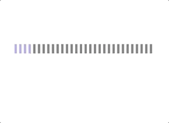
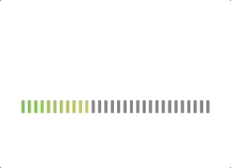

# react-native-dashed-progressbar
Dashed Gradient Progress bar for React Native.





```
import { DashedGradientProgressBar, Stop } from 'react-native-dashed-progressbar'
```

```
<DashedGradientProgressBar 
    percent={this.state.percent} 
    width={300} height={20}
    stopColors={[
    <Stop key={1} offset="0%" stopColor="#ada7f3" />,
    <Stop key={4} offset="75%" stopColor="#ff55b8" />
    ]}
    unfilledColor={"grey"}
    segmentWidth={10}
    gapWidth={10} />
```
